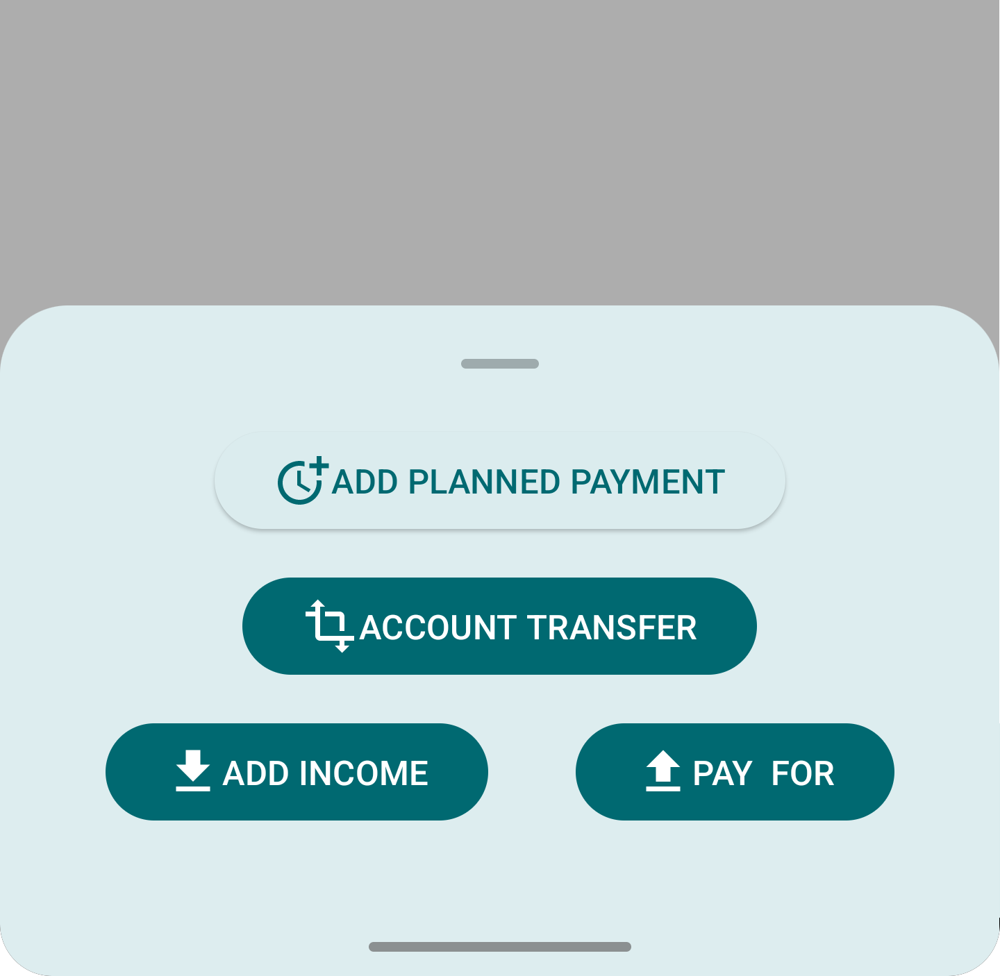
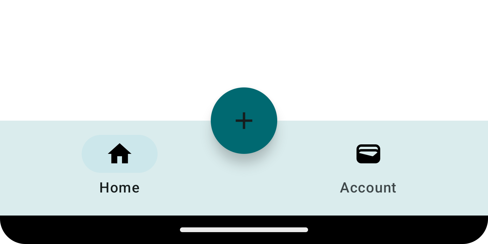
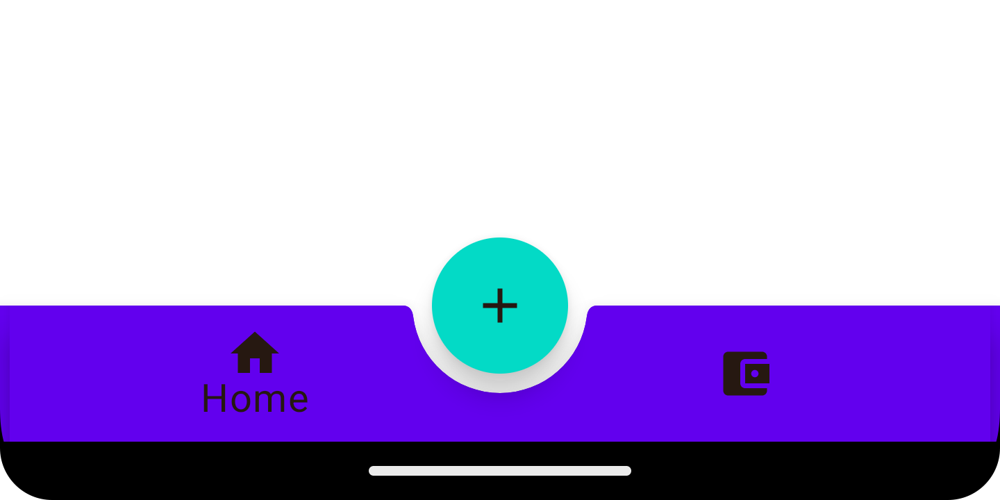

# MyAccounts
# Accounting app 記賬應用
Learn to use compose to write an App
學習使用 compose 編寫 App

<div align="center">
  
  
  
</div>

# UI設計部分需掌握：
UI design part needs to be mastered:
## 中文視頻講解：
Chinese video explanation:
1. cmpose佈局排版：https://youtu.be/FwuOG3HUc1E?si=d_Qj3wkD9iRSLs-0
2. ompose的路綫和導覽：https://youtu.be/GjWazFBrgWQ?si=TjEAAENEv63U3XjR
3. 協程的概念：https://youtu.be/jJrCVWfU1MM?si=bgu-cGnl3DU0JaKn
4. Lambda：https://youtu.be/HaoCIPZKA7w?si=SGoSKiaM5HVqHjuy

# UI design part needs to be mastered:
## English video explanation:
1. compose layout typesetting:
2. Routes and navigation for compose:
3. The concept of coroutine:
4. Lambda:

## 添加其它圖標 Add other icons
```kotlin
//添加全套材質圖標  Add a full set of material icons
implementation("androidx.compose.material:material-icons-extended")
```
